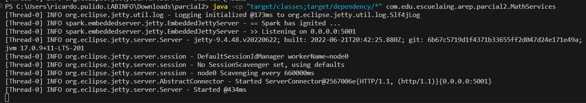
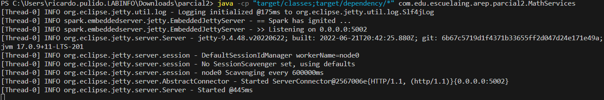
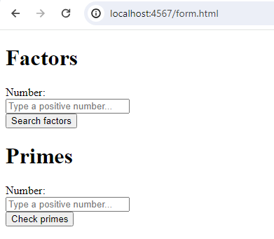
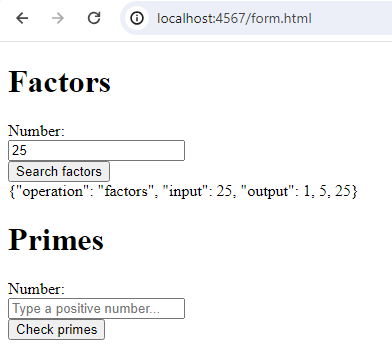
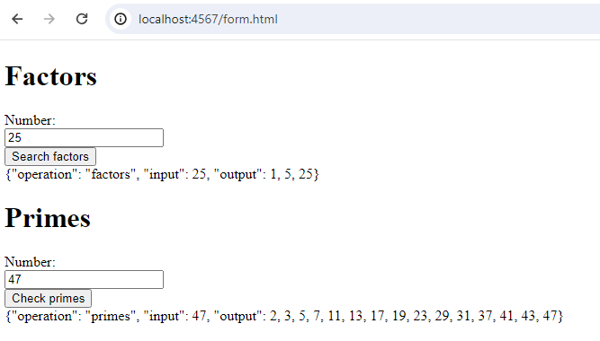
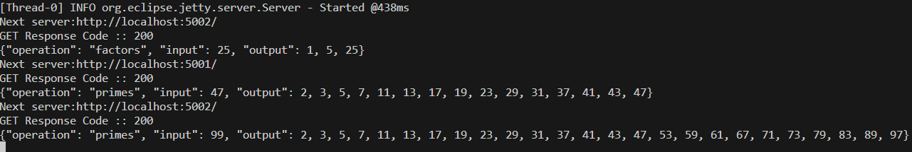

# Parcial Práctico 2
## AREP - 1
## *Hecho por Ricardo Pulido Renteria*

#### *Requisitos*
Para ejecutar este proyecto se requiere de:
+ Java 17 o superior
+ Maven 3.9 o superior
+ Git

#### *Descarga y preparación del proyecto*
Para descargar el proyecto, desde la línea de comandos vamos a ejecutar el siguiente comando:
```bash
git clone https://github.com/RicardoPR17/arep-parcial2.git
```

Con eso, podemos acceder a la carpeta y compilar el proyecto con los siguientes comandos:
```bash
cd arep-parcial2/
mvn clean install
```

#### *Ejecución*

Esta se realizará desde la línea de comandos. Primero, debemos ejecutar las instancias que necesitemos o deseemos del MathServices, el comando para ello es el siguiente:
+ Para Linux: `java -cp "target/classes:target/dependency/*" com.edu.escuelaing.arep.parcial2.MathServices`
+ Para Windows: `java -cp "target/classes;target/dependency/*" com.edu.escuelaing.arep.parcial2.MathServices`

Luego, ejecutamos el ProxyService pasándole por parámetros las url junto al puerto de las instancias de MathService con el comando:

+ Para Linux: `java -cp "target/classes:target/dependency/*" com.edu.escuelaing.arep.parcial2.ProxyService`
+ Para Windows: `java -cp "target/classes;target/dependency/*" com.edu.escuelaing.arep.parcial2.ProxyService`

**Ejemplo:** Manejando 2 instancias (una local y otra en otro equipo de la red local) de MathService, se podría ejecutar así en Windows
```bash
java -cp "target/classes;target/dependency/*" com.edu.escuelaing.arep.parcial2.ProxyService localhost:5001 192.168.5.113:5001
```

Esto, nos iniciaría el servicio al que podemos acceder por http://localhost:4567/form.hmtl

#### *Ejecución en EC2*

**Opcional:** Por comodidad, se pueden crear las instancias dentro del mismo grupo de seguridad. Debemos abrir los puertos 4567 y 5001 del grupo de seguridad. El primero es para el servicio de Proxy y el segundo para las instancias MathService.

Para ejecutar este proyecto en EC2, debemos instalar Java, Maven y Git usando el comando `sudo yum install ` seguido del elemento a instalar. Una vez terminan estos procesos se clonará y compilará el proyecto como se explicó anteriormente.

Para la ejecución, se usan los comandos de ejecución para Linux o el adecuado según el sistema operativo de la instancia. Primero se debe iniciar la ejecución de los MathService y copiamos las IPs privadas de estos. Luego, al ejecutar el ProxyService le vamos a pasar las IPs con el puerto 5001.

#### *Pruebas*

Para las pruebas en local, a continuación se muestra cómo se inician los servicios desde línea de comandos:
+ MathService



+ ProxyService con parámetros para los MathService


Al acceder al servicio por la ruta indicada, vemos el siguiente formulario:



Si enviamos un número, como el 25, para los factores veremos lo siguiente



Y si enviamos el 47 para ver los primos hasta ese número, veremos lo siguiente



Finalmente, si enviamos una nueva petición (primos hasta 99) y vemos los logs del proxy se verá como cambia entre servidores para dar respuesta a las peticiones



El cambio se identifica por los puertos que se usan.

A continuación se presenta el vídeo para evidenciar el funcionamiento del servicio en AWS: https://youtu.be/ihMoYm4ucsI
